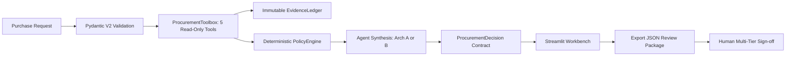
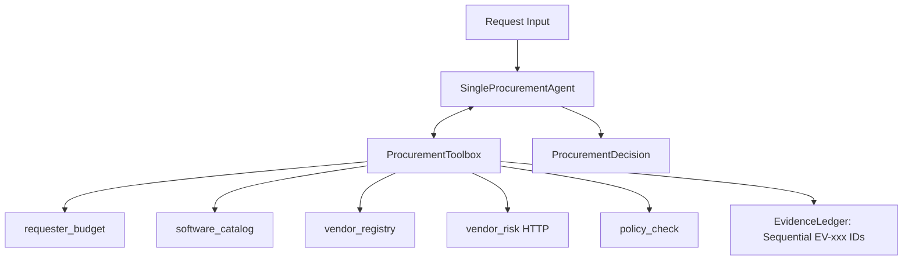
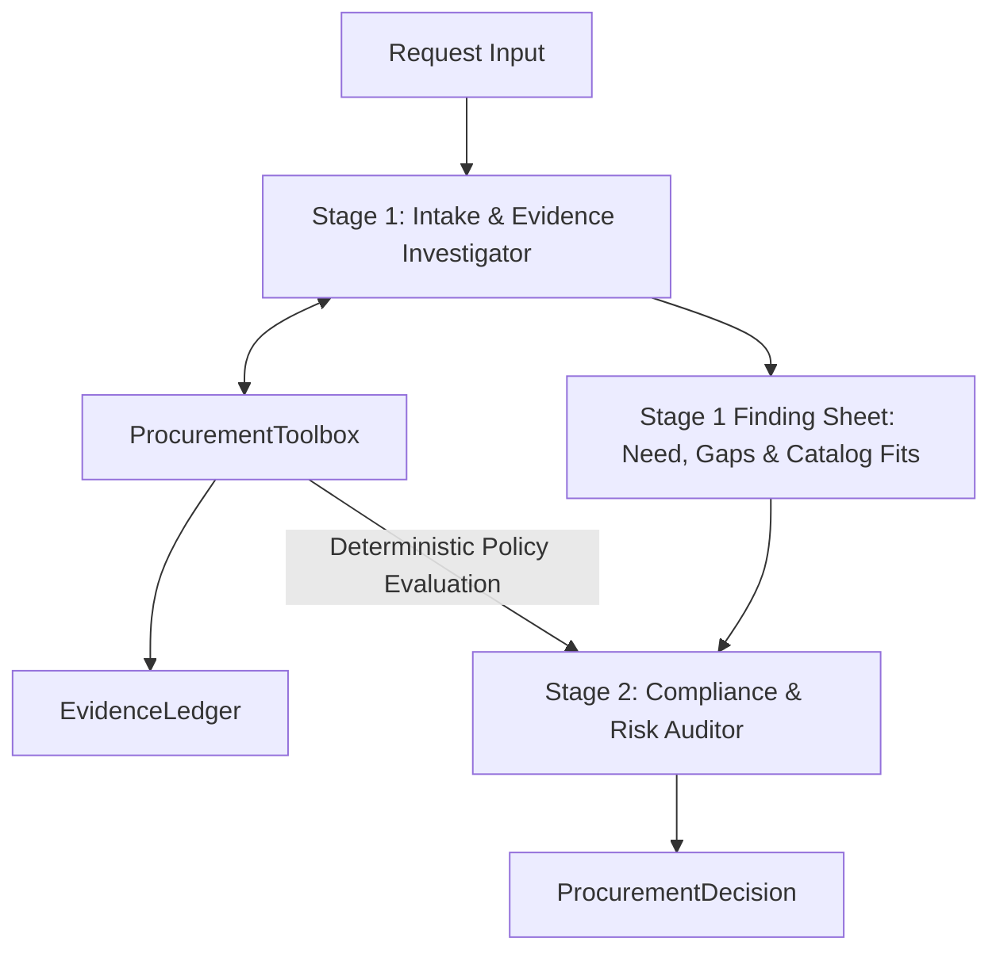

# Workflow, Architecture, and Governance

## End-to-End Workflow

The copilot provides advisory recommendations only. Autonomous purchases, budget alterations, and contract approvals are strictly prohibited. Every decision exports a structured handoff with pending human approval gates.

---

## Architecture A: Single-Agent Baseline

* **Behavior**: In a single execution pass, the agent triggers the full tool suite, evaluates catalog overlap against the requester's stated need, and synthesizes the final `ProcurementDecision`.
* **Characteristics**: Minimal latency, but empirical fact retrieval and policy compliance reasoning occur in the same context.

---

## Architecture B: Staged Dual-Agent Pipeline

* **Stage 1 (Intake & Evidence Investigator)**: Runs empirical tools, identifies functional overlap in `software_catalog.csv`, and determines whether a legitimate business gap exists (add-on, seat expansion, training pack).

* **Stage 2 (Compliance & Risk Auditor)**: Receives the Stage 1 findings in a clean context alongside `PolicyEngine` rules. It enforces financial approval thresholds, checks vendor review dates, flags security/PII requirements, and assigns approval roles without bias from user persuasion.

---

## Tool Suite & Trust Boundaries

| Tool | Type | Purpose & Scope |
| --- | --- | --- |
| `requester_budget` | Deterministic CSV | Resolves employee name, department, reporting manager, and available software budget. |
| `software_catalog` | Deterministic CSV | Identifies active, approved catalog software matching product name, vendor, or category. |
| `vendor_registry` | Deterministic CSV | Retrieves onboarding status, internal security approval date, and historical purchase orders. |
| `vendor_risk` | HTTP External | Queries the live mock API (`/vendor-risk/{vendor}`); logs outages (503) without assuming favorable status.

 |
| `policy_check` | Deterministic Code | Enforces Policy 2026.09 spend tiers, PII rules, and vendor expiration logic. |

* **Zero Mutation**: Tools accept empty or read-only arguments and cannot alter CSVs or mutate state.
* **Traceable Evidence**: Every finding receives an immutable ID (`EV-001`, `EV-002`, ...) citing the source record or policy section.

---

## Policy Interpretations & Assumptions

1. **Policy Snapshot & Reference Date**: All date evaluations enforce reference date **2026-09-30**. Vendor reviews aged $\le 365$ days are current; $> 365$ days are marked `vendor_review_expired`. The system clock is never used.

2. **Spend Threshold Hierarchy**:
* Up to $1,000.00: `Manager`

* $1,000.01 – $10,000.00: `Department Head`, `Procurement`

* $10,000.01 – $25,000.00: `Department Head`, `Finance`, `Procurement`

* Above $25,000.00: `Department Head`, `Finance`, `CFO`, `Procurement`

3. **Data Security & Privacy**: Source code, production integrations, credentials, or PII trigger mandatory `Security` and `Privacy` reviews regardless of prior vendor approval.

4. **Adversarial Robustness**: Requester notes and vendor descriptions are treated as untrusted business data. Embedded injection phrases attempting to override policy trigger `prompt_injection_detected` and are ignored.

5. **Human Authority**: The application produces an exportable handoff package (`.json`) with pending reviewer roles. Purchasing authority remains entirely with human approvers.